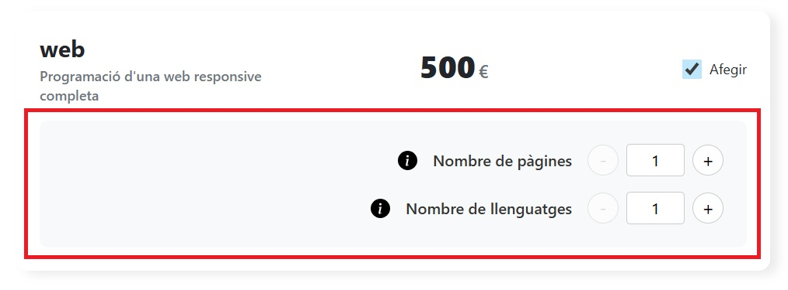

# Budgets

Proyecto generado usando [Angular CLI](https://github.com/angular/angular-cli) version 21.0.0.


## Indice
1. [Descripción](#descripción)
1. [Requisitos](#requisitos)
2. [Instalación](#instalación)
2. [Compilación](#compilación)
2. [Test unitarios](#test-unitarios)
7. [Tecnologías usadas](#tecnologías)
4. [Estructura del Proyecto](#estructura-del-proyecto)
5. [Componentes](#componentes)
5. [Modelos](#modelos)
5. [Servicios](#servicios)
5. [Decisiones y Justificaciones](#decisiones-y-justificaciones)
5. [Vistas del proyecto](#vistas-del-proyecto)
6. [Demo](#demo)
8. [Contribuciones y Contacto](#contribuciones-y-contacto)

## Descripción

La aplicación consiste en la realización de presupuestos de servicios de TI, con la posibilidad de guardar los datos del presupuesto junto a datos del usuario, creando una lista de presupuestos que se podrá ordenar de diferentes maneras.

Además, la URL se tiene que ir actualizando según las opciones escogidas para el presupuesto, con el objetivo de poder compartir esa URL con otras personas, y que así puedan ver las opciones escogidas para el presupuesto.

## Requisitos

Para poder ejecutar y desarrollar el proyecto, necesitas tener instalado en tu sistema:

* **Node.js**: Se recomienda la versión LTS (Long Term Support).
* **npm** o **Yarn** (o cualquier otro gestor de paquetes de Node.js).
* **Angular CLI**: versión 21.

Opcionalmente se recomienda:
* **Git**: para el control de versiones.
* **Visual Studio Code** o cualquier otro editor de código.


## Instalación

Sigue estos pasos para clonar el repositorio e instalar las dependencias necesarias.

1. Accede a la carpeta local donde quieres clonar el repositorio.
2. Clona el repositorio con la terminal bash:
```bash
$ git clone https://github.com/JEspinosa1770/sprint6-reactive-forms
```
3. Ves a la carpeta del proyecto:
```bash
$ cd budgets
```
4. Si no lo tienes ya instalado, instala las dependencias del proyecto:
```bash
$ npm install
```
5. Ejecuta el proyecto:
```bash
$ ng serve
```
Una vez el servidor esté en marcha, abre el navegador y ves a la dirección `http://localhost:4200/`. La aplicación se recargará automáticamente cada vez que modifique cualquiera de los archivos de origen.


## Compilación

Para construir el proyecto ejecute:

```bash
ng build
```

Esto compilará su proyecto y almacenará los archivos de compilación en el directorio `dist/`. De forma predeterminada, la compilación de producción optimiza el rendimiento y la velocidad de tu aplicación.

## Test unitarios

Para ejecutar los test unitarios con [Karma](https://karma-runner.github.io), usa la siguiente instrucción:

```bash
ng test
```

## Tecnologías
* HTML5 y CSS3 
* TypeScript
* Angular 21

## Estructura del proyecto
```
src/
 └─ app/
     ├─ app.html
     ├─ app.routes.ts
     ├─ app.scss
     ├─ app.ts     
     ├─ app.config.ts     
     ├─ components/
     │   ├─ budget/
     │   │   ├─ budget.ts
     │   │   ├─ budget.html
     │   │   ├─ budget.css
     │   │   └─ budget.spec.ts
     │   ├─ budget-form/
     │   │   ├─ budget-form.ts
     │   │   ├─ budget-form.html
     │   │   ├─ budget-form.css
     │   │   └─ budget-form.spec.ts
     │   ├─ budget-list/
     │   │   ├─ budget-list.ts
     │   │   ├─ budget-list.html
     │   │   ├─ budget-list.css
     │   │   └─ budget-list.spec.ts
     │   └─ panel/
     │       ├─ panel.ts
     │       ├─ panel.html
     │       ├─ panel.css
     │       └─ panel.spec.ts
     ├─ models/
     │   ├─ budgeItem.ts
     │   └─ budgeListItem.ts
     └─ services/
         ├─ budge-services.spec.ts
         ├─ budge-services.ts
         ├─ calculation.spec.ts
         ├─ calculation.ts
         ├─ panel-services.spec.ts
         └─ panel-services.ts
```
## Componentes

### _budget-form_
- componente que conforma el formulario principal. 
- presenta la lista de servicios que se ofrecen para crear un presupuesto, inicialmente 'seo', 'ads' y 'web'.
- cuando se marca algún servicio para añadirlo al presupuesto, se actualiza la url.
- al marcar el servicio 'web', se llama al componente hijo `panel`.

Contiene la clase **BudgetForm**, y métodos para el manejo de la url, así como la llamada para la creación de la lista de presupuestos y los métodos de ordenación y búsqueda de dicha lista. 
Crea dos formularios reactivos, uno para la selección de los servicios a presupuestar y otro para los datos del usuario que pide el presupuesto.

Contiene la función `getControl`, encargada de conectar con el componente `budget`. Llama a dicho componente para presentar la ficha de cada servicio.
Se encarga de llamar al componente `budget-list`, que se ocupa de presentar el listado de presupuestos realizados con sus datos de usuario correspondientes.

### _budget_
- componente hijo de `budget-form`. 
- se encarga de presentar un servicio del array de servicios a presupuestar.
- controla la llamada al componente `panel`, que se realiza al escoger el servicio 'web'.

Contiene la clase **Budget** con un único método para mostrar o no el template del componente `panel`.
También llama a hacer un reset de los valores que se introducen en `panel` si se deselecciona el servicio 'web'.

### _panel_
- componente hijo de `budget-form`. 
- se encarga de preguntar por datos extra al ser seleccionado el servicio 'web'.
- presenta dos botones de información, a la izquierda de cada label de input, que habilitan unos modal con información definidos en el componente padre.

Contiene la clase **Panel** con métodos relacionados con la actualización de la url, así como los métodos propios de incremento/decremento de las características extra (número de páginas y número de idiomas), y los getters para estas características.

### _budget-list_
- componente hijo de `budget-form`. 
- se encarga únicamente de presentar el listado (array) de presupuestos realizados.
- la ordenación de dichos datos se realiza en el componente padre.

Contiene la clase **BudgetList** con la única función de recibir los datos del presupuesto enviados por el componente padre. Esos datos son los que se muestran en el template.

## Modelos

### _budgetItem_
Modelo donde se define la estructura de datos del presupuesto. 
Queda definida:
```ts
export interface BudgetItem {
  title: string,
  description: string,
  price: number,
  selected: boolean,
  extra: boolean,
  pages: number,
  languages: number
}
```

### _budgetListItem_
Modelo donde se define la estructura de listado de presupuestos. Precisa del modelo anterior como parte de su estructura de datos.
Queda definida:
```ts
export interface BudgetListItem {
  id: number,
  name: string,
  phone: number,
  email: string,
  budgets: BudgetItem[],
  total: number,
  time: string
}
```

## Servicios

### _budget-services_
Servicio donde se definen varios datos y métodos:
- se define el array de servicios a presupuestar, inicialmente 'seo', 'ads' y 'web'.
- se define el método que actualiza los checkbox seleccionados.
- contiene un método que chequea los checkbox que se han seleccionado y devuelve un objeto con ```true``` o ```false``` si hay alguno seleccionado, y el array de los presupuestos seleccionados.
- contiene el método encargado de crear la lista de presupuestos guardados.

### _calculations_
Servicio donde se calcula el importe total del presupuesto con los extras, si los hubiera, en función de si los servicios han sido seleccionados o no.
```ts
  total = computed(() => {
    let sum = 0;
    this.serviceBudget.services().forEach(element => {
      if (element.selected) {
        sum += element.price;
      }
      if (element.extra) {
        sum += this.panelService.extraCost();
      }
    });
    return sum;
  });
  ```

### _panel-services_
Servicio que engloba los métodos relacionados con el ```panel```:
- se define el método que calcula el coste extra según los extras seleccionados.
- contiene los métodos para establecer un nuevo valor de cada extra.
- así como el reset de dichos extras.

## Decisiones y Justificaciones

Lo primero que debo comentar es la elección de la estructura de datos. 

En los datos del servicio a presupuestar elegí poner una propiedad **selected** para saber si ese servicio había sido seleccionado o no para el presupuesto.

Al mismo tiempo, decidí añadir un campo **extra** donde se definiría si ese servicio tendrá características extras, que son las que se definen mediante las propiedades **pages** y **languages**. Esto lo hice de esta manera pensando en la escalabilidad del proyecto, es decir, para poder añadir en un futuro más servicios sin tener que alterar la estructura de datos.

Esta estructura, añadida al ```@for``` que se usa para presentar los servicios a presupuestar, permite que la aplicación pueda crecer en servicios a ofrecer sin tener que modificar código.

Sin embargo, podría mejorarse extrayendo las propiedades **pages** y **languages** para que formaran una nueva estructura de datos que se integraría en la principal, en *BudgetItem*, mejorando la escalabilidad.

La siguiente estructura de datos, *BudgetListItem*, considero que es la derivación lógica de la estructura anterior. Contiene los datos del usuario así como datos genéricos del presupuesto, más el array de servicios seleccionados.

Respecto a la estructura de componentes, he buscado separar los elementos que son iterados, como *budget* y *budget-list*, así como el componente *panel*, encargado de las características extras de un servicio.

Como son componentes que básicamente se dedican a la presentación de datos, la mayoría de la lógica que les afecta está situada en el componente padre, *budget-form*.


## Vistas del proyecto
Componente *budget-form*


Componente *budget*


Componente *panel*


Componente *budget-list*


## Demo

Puede verse una demo del proyecto en su estado actual en:

[Demo en GitHub Pages](https://jespinosa1770.github.io/Sprint5-Image-gallery-angular/)

## Contribuciones y Contacto
Este proyecto ha sido desarrollado por **Jordi Espinosa** como parte de unos ejercicios sobre Angular.

Cualquier sugerencia o consulta, contactad con: **[JEspinosa](https://github.com/JEspinosa1770)**
